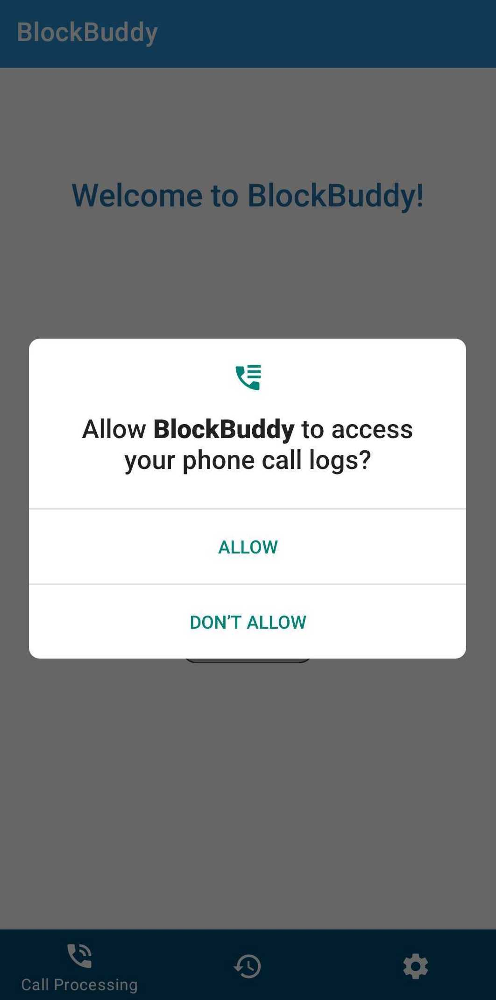

# BlockBuddy

BlockBuddy is a simple app for processing incoming phone calls. In the following sections, you can find instructions on how to use the app.

Note: All of these icons are used from Android Asset Studio.

## Installing and running the app

Download the Github repo to your local machine. In Android Studio, open a root folder - BlockBuddy. Build and run the project on your device (It's recommended to use a real device if you want to explore all features).

Once the app installation is finished, you can find the app by the icon below.

    

## Managing Permissions

Once you run the app for the first time, you'll be asked to allow needed permissions to be able to use the call-processing feature. 

The list of permissions that need to be allowed: 

1. Reading phone call logs

2. Accessing contact list

3. Managing phone calls

    
    
    

 If you're not sure do you want to allow these permissions at this moment, that's fine. Next time you request to run the call-processing feature, you'll be asked again.
 

    

Once you allow all permissions, you'll be ready to experience call processing. The main view contains a navigation bar with three tabs: **call processing, history** and settings **tab**. 

### Call Processing 

Once you open the app, the first tab is selected by default. To determine which tab is selected, look for the one which has a label. 

For starting processing calls, you need to start Processing Service. You can do that by clicking on the "play" button. To stop the service, use the same button. Once the service starts, you'll see a text and color indicators in the main view. 

  
  

The service can run even if you move your app to the background or terminate it. Also, if your device reboots while the service is running, the system will **start processing automatically** once it is back running. If you are not sure whilst the service is running and you don't want to open the app, you can check the status bar and look for its notification.

    

By default, the app has **three main approaches** when handing calls:

1. If a number is defined as a **scam**, the app blocks (ends) the call automatically.

2. If a number is defined as **suspicious**, the app provides additional information in a form of a pop-up notification.

    

3. If a number is **not a scam or suspicious**, the app allows a call.

   

### Call History

Another feature this app has is to preview how many calls (suspicious, scam or normal) you had. To check that out, click on the **history icon** in the navigation bar.

    

### Advanced Settings

The app provides an option to **block all calls except those from a contact list**. To enable this feature, go the settings page by clicking the most right icon, and change the switch indicator next to the option. If you want to block calls from a **specific number only**, insert the phone number and click **Add**. Once the number is saved, you'll see a confirmation message on the bottom and the number in the list.

    

# Technical explanation

The app uses three fragments. For switching between them, the app uses a Navigation Component and https://developer.android.com/guide/navigation/navigation-design-graph (Jetpack Compose). I wanted to try this out for some time now, so I decided to go with Bottom Navigation Bar. 

Most of the components are from Material Design. 

The architecture pattern is MVVM.

Processing service is a foreground service since we are limited to using background tasks. Therefore, it has an appropriate notification when running. The service posts another notification (heads-up) once it receives a call from a suspicious number. 

After searching for a solution for blocking calls, I decided to go with ITelephony for versions older than Android 9 (API level 28), and Telecom Manager for newer versions. I saw a lot of comments on CallScreeningService, and since I have a "deadline" on this assignment, I didn't want to go deep into it. I went through the basic CallScreeningService implementation, though. 

For receiving calls and starting the service after rebooting I used Broadcast Receiver - a standard solution.

For blocking a specific number, I used Shared Preferences. In my opinion, there is a far better solution. However, this is a really simple app, and the data is not complex so I decided to go with SharedPrefereces. Ideally, I would use the system's blocked number list. However, not only does this require more work and time, the user would need to set this app as a default dialer and it would require more permissions. Overall, looks like overkill for this assignment. This could be an upgrade sometimes in the future. Then, the blocked numbers would be in one place.

Regarding dependency injection, I decided to go with Koin. I could use Hilt or even Dagger here, but again this should be a simple app and I there is no point in using annotation processors for such a simple task. Though Koin has a lower efficiency because of resolving dependencies in the runtime, I think it serves the purpose in this project.

I added one part of tests - unit tests for VMs. 

Here are some features that can be included in the next stages:

- coroutines for executing background work, maybe even a WorkManager to help with service actions
- upgrade dependency injection to Hilt
- allow blocking SMS messages
- enable deleting blocked numbers
- use system's BlockedNumberContract
- add UI tests
